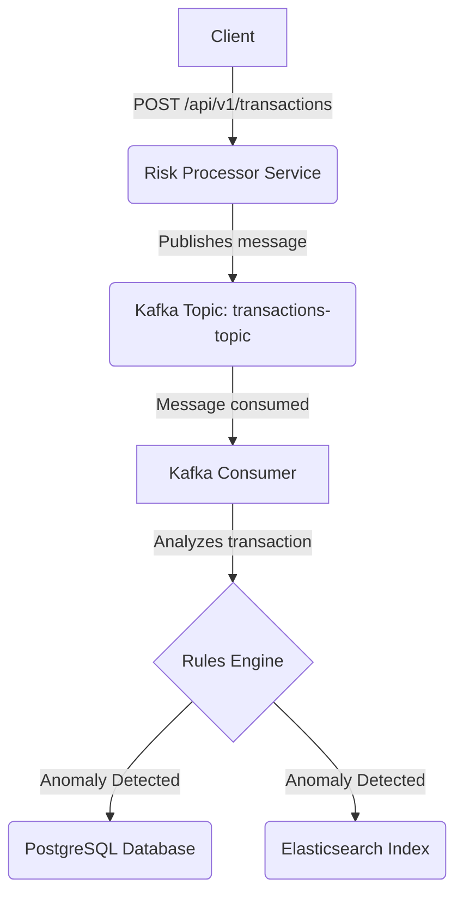

# Risk Processor Showcase

This project is a comprehensive showcase of a modern, event-driven microservice application designed to process and analyze financial transactions for risk. It demonstrates a full software development lifecycle, from local development to a fully containerized application deployed on a cloud-native infrastructure managed by code.

## Project Overview

The primary goal of this application is to ingest financial transactions, analyze them against a set of configurable rules to detect anomalies, and persist the findings for compliance and search purposes. This project serves as a practical demonstration of skills in Solution Architecture, Backend Development, and DevOps/Platform Engineering.

## Core Features

- **Asynchronous ingestion** of transaction data via a REST API endpoint.
- **Event-driven processing core** using Apache Kafka to decouple services.
- **Configurable rules engine** to detect anomalies (e.g., high-value transactions).
- **Hybrid Persistence Model:**
  - Anomalies are stored in PostgreSQL for compliance and as a transactional system of record.
  - Anomalies are also indexed in Elasticsearch for fast, flexible, and complex search queries.

## Architecture

The system follows a distributed, event-driven architecture to ensure scalability, resilience, and loose coupling between components.

### Data Flow

1. A POST request with transaction data is received by the REST Controller.
2. The controller immediately delegates the request to a service that publishes the transaction as a message to a Kafka Topic. The client receives a `202 Accepted` response, confirming the request has been queued.
3. A Kafka Consumer service listens to the topic, consuming transactions one by one for processing.
4. The consumer passes the transaction to the Risk Analysis Service, which applies a set of configurable business rules.
5. If an anomaly is detected, the result is persisted in both the PostgreSQL database and the Elasticsearch index.

### Architecture Diagram



## Tech Stack & Tools

### Backend

- Java 17
- Spring Boot 3
- Spring Web (REST APIs)
- Spring Kafka (Kafka integration)
- Spring Data JPA (PostgreSQL)
- Spring Data Elasticsearch (Elasticsearch)
- Gradle (build tool)

### Databases & Messaging

- **PostgreSQL:** System of record for anomalous transactions.
- **Elasticsearch:** Search engine for querying and visualizing anomalies.
- **Apache Kafka:** Asynchronous message broker for event-driven communication.

### DevOps & Infrastructure

- Docker & Docker Compose: Containerization and local development.
- Kubernetes (GKE): Container orchestration for cloud deployment.
- Helm: Package manager for deploying dependencies (PostgreSQL, Kafka, etc.) on Kubernetes.
- Terraform: Infrastructure as Code (IaC) for GCP provisioning.
- Google Artifact Registry: Docker image storage.
- Git & GitHub: Version control.

### Cloud Provider

- Google Cloud Platform (GCP)

## Getting Started (Local Development)

### Prerequisites

- Java 17 (or newer)
- Docker and Docker Compose

### Running the Environment

Start the infrastructure (Kafka, PostgreSQL, Elasticsearch):

```bash
docker-compose up -d
```

Run the Spring Boot application:

```bash
./gradlew bootRun
```

Send a test request (using Postman or curl):

```json
POST http://localhost:8080/api/v1/transactions
Content-Type: application/json

{
  "transactionId": "tx-local-123",
  "amount": 15000.00,
  "currency": "EUR",
  "timestamp": "2025-08-04T12:00:00Z",
  "originator": "acc-local-1",
  "beneficiary": "acc-local-2"
}
```

## Cloud Deployment on Google Kubernetes Engine (GKE)

- The entire cloud infrastructure is defined as code in the `/terraform` directory.
- The VPC Network and GKE Cluster are provisioned using Terraform.
- Stateful dependencies (PostgreSQL, Kafka, Elasticsearch) are deployed onto the cluster using Helm charts.
- The application's Docker image is built and pushed to Google Artifact Registry.
- The risk-processor service is deployed using Kubernetes manifests located in the `/kubernetes` directory.
