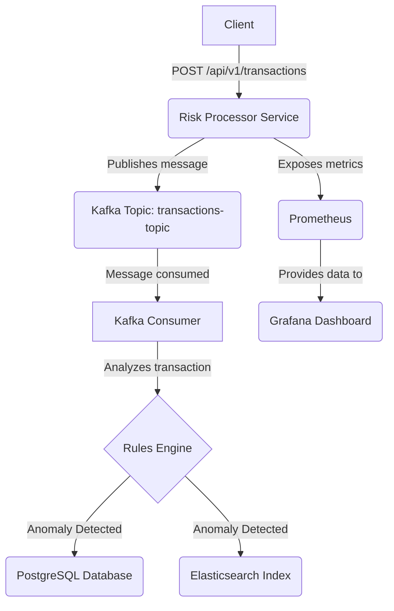

# Risk Processor Showcase

This project is a comprehensive showcase of a modern, event-driven microservice application designed to process and analyze financial transactions for risk. It demonstrates a full software development lifecycle, from local development to a fully containerized application deployed, monitored, and tested on a cloud-native infrastructure.

## Project Overview

The primary goal of this application is to ingest financial transactions, analyze them against a set of configurable rules to detect anomalies, and persist the findings for compliance and search purposes. This project serves as a practical demonstration of skills in Solution Architecture, Backend Development, and DevOps/Platform Engineering.

## Core Features

- **Asynchronous ingestion** of transaction data via a REST API endpoint.
- **Event-driven processing core** using Apache Kafka to decouple services.
- **Configurable rules engine** to detect anomalies (e.g., high-value transactions).
- **Hybrid Persistence Model:** Anomalies are stored in PostgreSQL (for compliance) and indexed in Elasticsearch (for search).
- **Automated CI/CD Pipeline** that builds and runs all tests on every commit using GitHub Actions.
- **Production-Grade Observability** with a full monitoring stack using Prometheus and Grafana.
- **Interactive API Documentation** through Swagger UI (OpenAPI 3).

## Architecture

The system follows a distributed, event-driven architecture to ensure scalability, resilience, and loose coupling between components.

### Data Flow

1. A POST request with transaction data is received by the REST Controller.
2. The controller immediately publishes the transaction as a message to a Kafka Topic. The client receives a 202 Accepted response.
3. A Kafka Consumer service listens to the topic and processes transactions.
4. The consumer passes the transaction to the Risk Analysis Service, which applies business rules.
5. If an anomaly is detected, the result is persisted in both PostgreSQL and Elasticsearch.

### Architecture Diagram



## Tech Stack & Tools

### Backend & API

- Java 17 & Spring Boot 3
- Spring Web (REST APIs), Spring Kafka, Spring Data JPA & Elasticsearch
- Swagger / OpenAPI 3 for API Documentation
- Gradle

### Databases & Messaging

- PostgreSQL, Elasticsearch, Apache Kafka

### DevOps & Infrastructure

- Docker & Docker Compose
- Kubernetes (GKE) & Helm
- Terraform (IaC)
- GitHub Actions (CI/CD)
- Google Artifact Registry

### Observability & Testing

- Prometheus & Grafana
- JUnit 5, Mockito & Testcontainers
- Spring Boot Test Slices (`@DataJpaTest`)

## Observability & Monitoring

The application is fully instrumented for monitoring using Micrometer, exposing metrics in a Prometheus-compatible format. The local `docker-compose.yml` includes a complete monitoring stack:

- Prometheus is configured to automatically scrape metrics from the application.
- Grafana is included with a pre-configured data source for Prometheus. You can easily import community dashboards (like ID 4701) to get instant visibility into JVM performance.

## Testing Strategy

The project follows a multi-layered testing strategy to ensure code quality:

- **Unit Tests:** Core business logic is tested in isolation using Mockito.
- **Integration Tests:** The persistence layer is tested using `@DataJpaTest` against a real PostgreSQL database provisioned by Testcontainers.
- **Automated CI Pipeline:** All tests are automatically executed on every push via a GitHub Actions workflow, preventing regressions.

## Getting Started (Local Development)

### Prerequisites

- Java 17 (or newer)
- Docker and Docker Compose

### Running the Environment

Start the infrastructure (Kafka, Databases, Monitoring):

```bash
docker-compose up -d
```

Run the Spring Boot application:

```bash
./gradlew bootRun
```

### Exploring the Services

- **API Documentation (Swagger UI):** [http://localhost:8080/swagger-ui.html](http://localhost:8080/swagger-ui.html)
- **Prometheus Targets:** [http://localhost:9090/targets](http://localhost:9090/targets)
- **Grafana Dashboard:** [http://localhost:3000](http://localhost:3000) (login: admin/admin)

## Cloud Deployment on Google Kubernetes Engine (GKE)

The entire cloud infrastructure (VPC, GKE Cluster) is defined as code in the `/terraform` directory. The deployment process is fully automated and documented within the repository.
