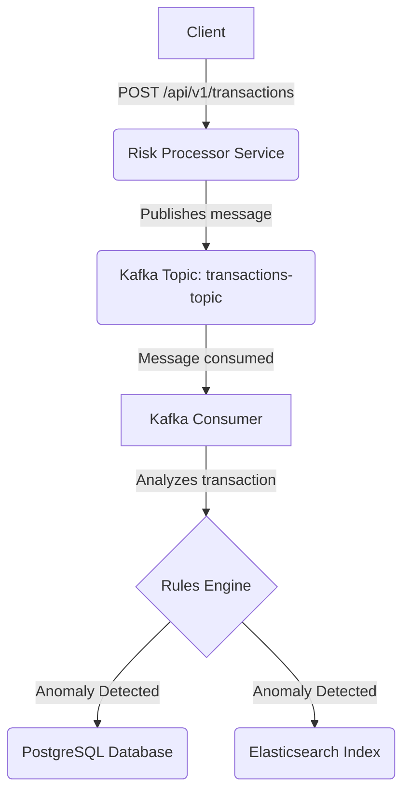

graph TD
A[Client] -- POST /api/v1/transactions --> B(Risk Processor Service)
B -- Publishes message --> C(Kafka Topic: transactions-topic)
C -- Message consumed --> D[Kafka Consumer]
D -- Analyzes transaction --> E{Rules Engine}
E -- Anomaly Detected --> F(PostgreSQL Database)
E -- Anomaly Detected --> G(Elasticsearch Index)
docker-compose up -d

# Risk Processor Showcase

This project is a comprehensive showcase of a modern, event-driven microservice application designed to process and analyze financial transactions for risk. It demonstrates a full software development lifecycle, from local development to a fully containerized application deployed on a cloud-native infrastructure managed by code.

## Project Overview

The primary goal of this application is to ingest financial transactions, analyze them against a set of configurable rules to detect anomalies, and persist the findings for compliance and search purposes. This project serves as a practical demonstration of skills in Solution Architecture, Backend Development, and DevOps/Platform Engineering.

## Core Features

- **Asynchronous ingestion** of transaction data via a REST API endpoint.
- **Event-driven processing core** using Apache Kafka to decouple services.
- **Configurable rules engine** to detect anomalies (e.g., high-value transactions).
- **Hybrid Persistence Model:**
  - Anomalies are stored in **PostgreSQL** for compliance and as a transactional system of record.
  - Anomalies are also indexed in **Elasticsearch** for fast, flexible, and complex search queries.
- **Automated CI/CD Pipeline** that builds and runs all tests on every commit.
- **Interactive API Documentation** through Swagger UI.

## Architecture

The system follows a distributed, event-driven architecture to ensure scalability, resilience, and loose coupling between components.

### Data Flow

1. A POST request with transaction data is received by the REST Controller.
2. The controller immediately delegates the request to a service that publishes the transaction as a message to a Kafka Topic. The client receives a 202 Accepted response.
3. A Kafka Consumer service listens to the topic and processes transactions.
4. The consumer passes the transaction to the Risk Analysis Service, which applies business rules.
5. If an anomaly is detected, the result is persisted in both PostgreSQL and Elasticsearch.

### Architecture Diagram



## Tech Stack & Tools

### Backend & API

- Java 17 & Spring Boot 3
- Spring Web (REST APIs)
- Spring Kafka
- Spring Data JPA & Spring Data Elasticsearch
- Gradle
- Swagger / OpenAPI 3 for API Documentation

### Databases & Messaging

- PostgreSQL
- Elasticsearch
- Apache Kafka

### DevOps & Infrastructure

- Docker & Docker Compose
- Kubernetes (GKE)
- Helm
- Terraform (IaC)
- GitHub Actions (CI/CD)
- Google Artifact Registry
- Git & GitHub

### Testing

- JUnit 5 & Mockito
- Testcontainers
- Spring Boot Test Slices (`@DataJpaTest`)

## Testing Strategy

The project follows a multi-layered testing strategy to ensure code quality and reliability:

- **Unit Tests:** The core business logic in the `RiskAnalysisService` is tested in isolation using Mockito to mock dependencies.
- **Integration Tests:** The persistence layer is tested using the `@DataJpaTest` slice. These tests run against a real PostgreSQL database provisioned by Testcontainers, ensuring the JPA repository functions correctly.
- **Automated CI Pipeline:** All tests are automatically executed on every push to the main branch via a GitHub Actions workflow, preventing regressions and ensuring code quality.

## Getting Started (Local Development)

### Prerequisites

- Java 17 (or newer)
- Docker and Docker Compose

### Running the Environment

Start the infrastructure (Kafka, PostgreSQL, Elasticsearch):

```bash
docker-compose up -d
```

Run the Spring Boot application:

```bash
./gradlew bootRun
```

## Exploring the API

Once the application is running, the interactive API documentation is available at:

- **Swagger UI:** [http://localhost:8080/swagger-ui.html](http://localhost:8080/swagger-ui.html)

You can use the Swagger UI to send test requests.

## Cloud Deployment on Google Kubernetes Engine (GKE)

- The entire cloud infrastructure (VPC, GKE Cluster) is defined as code in the `/terraform` directory.
- Stateful dependencies are deployed onto the cluster using Helm charts.
- The application's Docker image is built and pushed to Google Artifact Registry.
- The service is deployed using Kubernetes manifests located in the `/kubernetes` directory.
